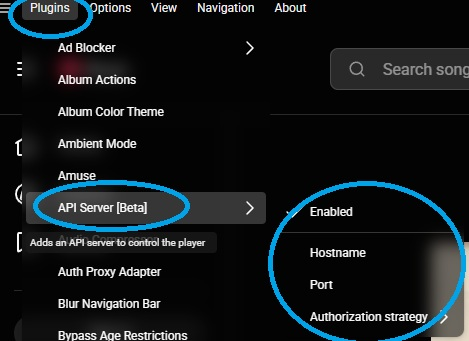
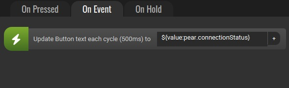
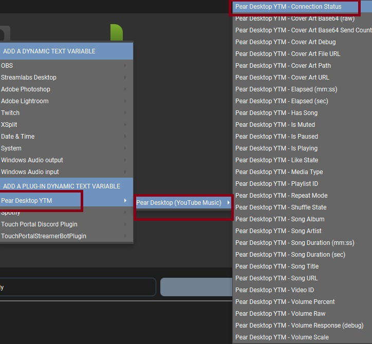
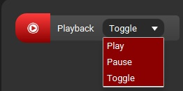
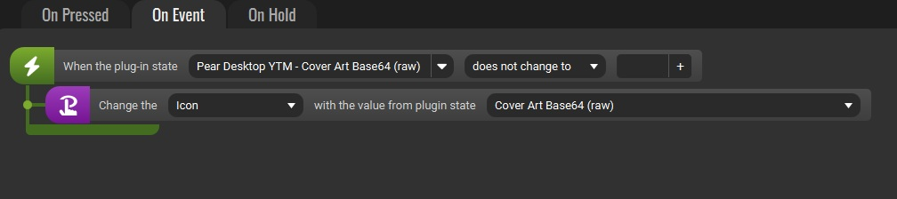
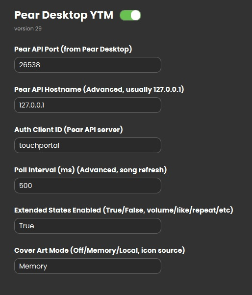

# PearYTM TouchPortal Plugin (by HellBlazer90)

This TouchPortal plugin controls Pear Desktop (YouTube Music) through the local YouTube Music API Server.

> [!WARNING]
> **Personal project notice:** I made this entirely with an LLM for personal use in a day. I do not plan to update it. If you want to continue support, feel free. Thank you in advance.

> [!NOTE]
> Some instructions may be written directly by an LLM.

## New in v29.1

- Added a `Startup Status` state to show startup progress and highlight missing Node.js or restart needs.

For a guided walkthrough of settings, actions, and states, see `USER_GUIDE.md`.

## Index

- [Installation (User)](#installation-user)
- [Tested With](#tested-with)
- [TouchPortal Settings](#touchportal-settings)
- [Connection Status](#connection-status)
- [Troubleshooting History (What Went Wrong + Fixes)](#troubleshooting-history-what-went-wrong--fixes)
- [Installation (Advanced / Build from Source)](#installation-advanced--build-from-source)
- [Swagger and Endpoint Paths](#swagger-and-endpoint-paths)
- [Actions](#actions)
- [Connectors](#connectors)
- [Events](#events)
- [States](#states)

## Tested With

- Pear Desktop 3.11.00
- TouchPortal 4.4 Build 6

## Installation (User)

These steps are for end users. Add screenshots where noted.

Requirements:
- Node.js 18+ (the plugin uses built-in `fetch`).
- If you install Node.js while TouchPortal is running, restart TouchPortal so the plugin can see it in PATH.
- Pear Desktop with the YouTube Music API Server enabled.

Steps:
1) Enable the YouTube Music API Server in Pear Desktop and note the port (default 26538).
   - 🍐 Pear Desktop: https://github.com/pear-devs/pear-desktop
2) Download `PearYTM.tpp` from the latest GitHub Release.
3) TouchPortal -> Settings -> Plug-ins -> Import -> select `PearYTM.tpp`. You can also double-click the `.tpp` file.
4) Restart TouchPortal.
5) Open the plugin settings and enter the Pear API Port/Hostname if needed; it must match the Pear Desktop API.
6) Create an action button "Dynamic Text Updater" and select "Pear Desktop YTM - Connection Status" (or `${value:pear.connectionStatus}`) to show the current connection with the API.
7) Optional: Run the action `Pear Desktop -> Generate Token`
8) If Connection Status is "Connected", you can now start to add actions.


 


⬆️⬆️⬆️ This picture is the API Server of Pear Desktop YTM:

    HostName: 127.0.0.1 (default)
    Port: 26538 (default)
    Authorization strategy: Authorize at first request





This is the dynamic text needed to view connection status (you can also select other to show Artist, Album, Song, etc.)





This is the dynamic text to add for connection status





This is an example of the action buttons (some of them has different options)





This is the actions you need to show cover art





This is the settings as default, no need to change anything (maybe poll interval if you find that is getting laggy, but updates can take longer)


 
## TouchPortal Settings

The plugin builds the base URL as `http://{hostname}:{port}`. Users only enter:

- Pear API Port (from Pear Desktop, default 26538)
- Pear API Hostname (Advanced, usually 127.0.0.1)
- Auth Client ID (Pear API server, default touchportal)
- Poll Interval (ms) (Advanced, song refresh, default 500)
- Extended States Enabled (True/False, volume/like/repeat/etc, default True)
- Cover Art Mode (Off/Memory/Local, icon source, default Memory)

If you still see "no settings" in TouchPortal, remove the plugin and re-import the latest `.tpp`.

Volume values are always percent (0-100).

Extended States Enabled controls the extra endpoints (like/repeat/shuffle/volume/url/video/playlist/media) to reduce load if you only need basic song states.

## Connection Status

The state `pear.connectionStatus` shows:

- `Connected` when auth + song fetch succeeds.
- `Disconnected` when Pear Desktop is not reachable.
- `Auth failed (...)` or `Error (...)` for other failures.

Place the state on a button to view connection status in your UI.

## Startup Status

The state `pear.startupStatus` shows startup progress and quick guidance, such as:

- `Plugin not running (Node.js 18+; restart TouchPortal)` when the plugin cannot start.
- `TouchPortal connected; checking API` during initial connection.
- `Ready` once the plugin is connected and running.
- `Waiting for API` if the API is unreachable.

Place the state on a button or use a Dynamic Text Updater to surface this hint.

## Troubleshooting History (What Went Wrong + Fixes)

This project hit a bunch of common TouchPortal/plugin issues. Here is what happened and how we solved it:

- No settings in TouchPortal: switched to SDK 6, used `settings` with `type: "text"`, bumped `version`, re-imported.
- Import errors / stuck on assets: removed external deps and `node_modules`; rely on Node 18+ built-in `fetch`.
- Actions not showing: added `prefix`, `type: "communicate"`, and `format` for actions in `entry.tp`.
- Auth token missing: API returns `accessToken` (not just `access_token`); accept all variants.
- Swagger JSON not found: Swagger UI uses `/doc` for OpenAPI, not `/swagger.json`.
- Settings not applied: TouchPortal sends settings as an array of single-key objects; parser updated.
- Double Play/Pause: TouchPortal sends down+up; ignore those for actions and debounce repeats.
- Logs cut off: shortened plugin name to `Pear Desktop YTM` so TP log header fits.
- Set Volume not working: API expects `body: { volume }`; clamp 0-100 and use integer input.

## Installation (Advanced / Build from Source)

TouchPortal `.tpp` files are ZIPs that contain a top-level plugin folder. For this plugin the folder name should be `com.hellblazer90.pear.ytm`.

This section is for developers or advanced users who want to build the `.tpp` from source.

1. Build the `.tpp` (PowerShell):

```powershell
$root = Resolve-Path .
$stage = Join-Path $root "package\\com.hellblazer90.pear.ytm"
$zipPath = Join-Path $root "PearYTM.zip"
$tppPath = Join-Path $root "PearYTM.tpp"
New-Item -ItemType Directory -Force -Path $stage | Out-Null
Copy-Item -Force (Join-Path $root "plugin\\entry.tp") $stage
Copy-Item -Force (Join-Path $root "start.cmd") $stage
Copy-Item -Recurse -Force (Join-Path $root "src") $stage
Copy-Item -Force (Join-Path $root "package.json") $stage
Copy-Item -Force (Join-Path $root "USER_GUIDE.md") $stage
if (Test-Path $zipPath) { Remove-Item $zipPath -Force }
if (Test-Path $tppPath) { Remove-Item $tppPath -Force }
Compress-Archive -Force -Path $stage -DestinationPath $zipPath
Move-Item -Force $zipPath $tppPath
```

2. Install the `.tpp` in TouchPortal:
   - Settings -> Plug-ins -> Import -> select `PearYTM.tpp`, then restart TouchPortal.

## Swagger and Endpoint Paths

Open Swagger at:

```
http://127.0.0.1:<port>/swagger
```

The raw OpenAPI document is served at:

```
http://127.0.0.1:<port>/doc
```

Update endpoint paths and methods in `src/pearApi.js` to match Swagger. Only `/api/v1/song` is assumed to exist.

Look for the `ENDPOINTS` object and replace placeholders for any action you want to use, for example:

```js
const ENDPOINTS = {
  auth: { method: "POST", path: "/auth/{id}" },
  song: { method: "GET", path: "/api/v1/song" },
  playPause: { method: "POST", path: "/api/v1/yourPlayPausePath" },
  next: { method: "POST", path: "/api/v1/yourNextPath" },
  prev: { method: "POST", path: "/api/v1/yourPrevPath" },
  like: { method: "POST", path: "/api/v1/yourLikePath" }
};
```

If Swagger shows `GET /auth/{id}` instead of `POST`, update `ENDPOINTS.auth.method`.

For actions that take a value (seek/volume), you can use:
- `{value}` in the path, e.g. `/api/v1/seek/{value}`
- or `valueIn: "query"` / `valueIn: "body"` with optional `valueKey`

Example (query string):
```js
seekTo: { method: "POST", path: "/api/v1/seek", valueIn: "query", valueKey: "position" }
```

Example (JSON body):
```js
volume: { method: "POST", path: "/api/v1/volume", valueIn: "body", valueKey: "percent" }
```

## Actions
- Playback (Play/Pause/Toggle)
- Next/Previous
- Like/Dislike
- Volume (Up/Down)
- Set Volume
- Mute (Mute/Unmute/Toggle)
- Seek (Forward/Rewind)
- Seek To
- Repeat (Toggle/OFF/ALL/ONE)
- Shuffle (Toggle/On/Off)
- Play Track (Queue Index)
- Add Track to Queue
- Generate Token
- Refresh States

## Connectors
- Volume Slider (0-100). Keep Extended States Enabled for live feedback.

## Events
- Playback Is Paused (True/False)
- Like State (INDIFFERENT/LIKE/DISLIKE)
- Repeat Mode (NONE/ALL/ONE)
- Shuffle State (True/False)

## States
- Song Title
- Song Artist
- Song Album
- Cover Art URL
- Cover Art Path
- Cover Art File URL
- Cover Art Base64 (raw)
- Cover Art Base64 Send Count
- Cover Art Debug
- Has Song
- Is Paused
- Is Playing
- Song Duration (sec)
- Song Duration (mm:ss)
- Elapsed (sec)
- Elapsed (mm:ss)
- Volume Percent
- Volume Raw
- Volume Scale
- Volume Response (debug)
- Is Muted
- Like State
- Repeat Mode
- Shuffle State
- Song URL
- Video ID
- Playlist ID
- Media Type
- Connection Status
- Startup Status
- Startup Status
